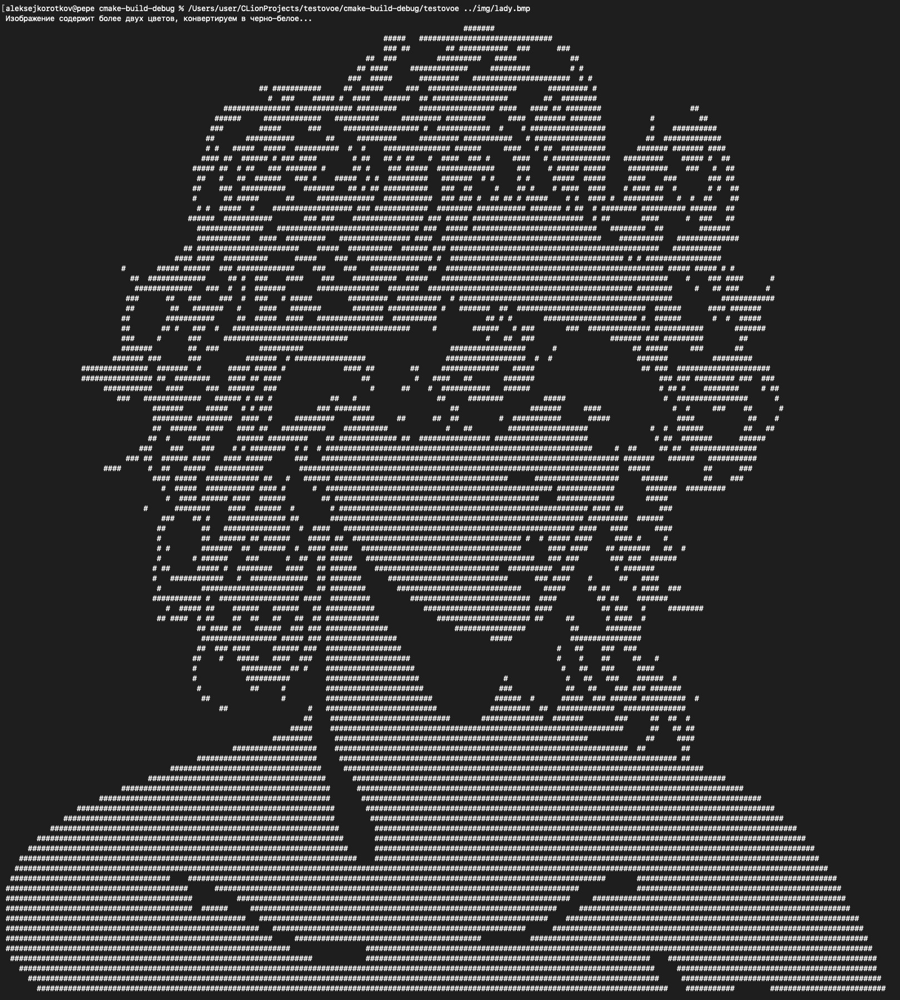
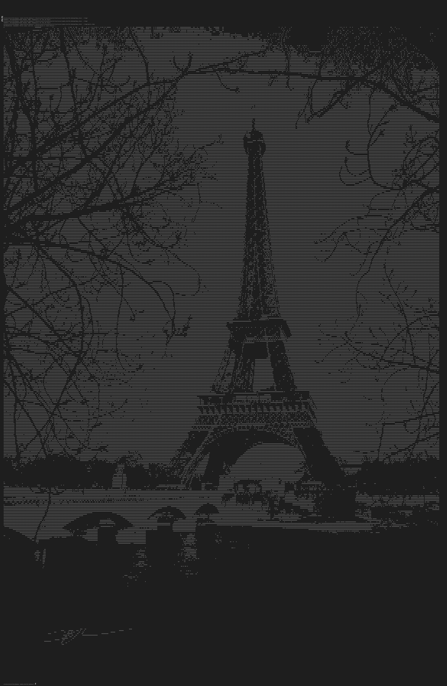

# BMP Image Viewer

## Описание

Это программа для чтения и отображения изображений в формате BMP в консоли, а также для их конвертации в черно-белый (только черный и только белый) формат. Программа проверяет, содержит ли изображение больше двух цветов, и, если это так, преобразует его в черно-белое изображение, отображая результат в консоли.

_Дальше под черно-белым форматом понимается бинарный формат: #000 и #fff, а под цветным - любой другой_
## Функции

- Чтение BMP-файлов с глубиной цвета **24 или 32 бита**.
- Проверка изображения на наличие более двух цветов.
- Автоматическое преобразование в черно-белый формат, если изображение цветное.
- Отображение изображения в текстовом виде (символы `#` для белого и пробелы для черного).
- Обработка исключений: программа выводит информативные сообщения об ошибках при неправильных действиях.
- Многопоточная обработка для увеличения производительности при конвертации в черно-белое изображение.

## Требования

Для сборки и работы программы необходимы:

- CMake 3.10 или новее.
- Компилятор с поддержкой C++11 и выше (например, `g++` или `clang++`).
- Стандартная библиотека C++.
- Операционная система, поддерживающая работу с консолью.

## Сборка проекта

Для сборки проекта с использованием `CMake`, выполните следующие шаги:

1. Клонируйте репозиторий или скопируйте исходный код программы в локальную директорию.

2. В терминале перейдите в корневую директорию проекта и выполните следующие команды:

```bash
mkdir build
cd build
cmake ..
make
```

## Использование
После компиляции запустите программу, передав путь к BMP-файлу как аргумент:

Например
```bash
cmake-build-debug/bmp_show img/lady.bmp
```

### Программа выполнит следующие действия:

- Откроет BMP-файл.
- Если изображение содержит более двух цветов, оно будет конвертировано в черно-белое.
- Изображение отобразится в консоли в виде символов # и пробелов.

## Обработка ошибок
Программа обрабатывает следующие ошибки:

Ошибка открытия файла: если указанный файл не существует или не может быть открыт.
Неподдерживаемый формат: если формат BMP не является 24-битным или 32-битным.
Все ошибки выводятся в консоль с информативными сообщениями.

## Многопоточность
Для увеличения производительности программа использует многопоточность при конвертации изображения в черно-белый формат. Это особенно полезно для больших изображений, так как процесс разделяется на два потока.

## Результаты




